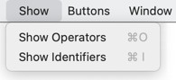
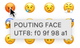
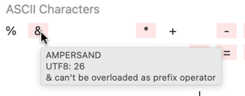
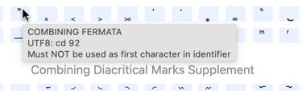
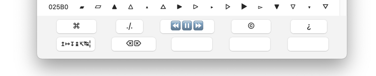

# Swift-Unicode-Picker

Swift Unicode Picker is a MacOS app to simplify choosing exotic operator and identifier names in Swift. 

## The hot key

If the program is running in the background, it can be activated with the hot key ^⇧U (control-shift-U).

## The character table

The program has one window with a list of Unicode characters. You select if you want to se operator or identifier characters from the menu.

If you hoover with the cursor over a character in the list, the characters Unicode name and UTF8 hexcode is displayed. 

If the background of the character is pink, some other information is also shown.

If the background is light blue, the character cannot be used as first character in operator/identifier.

When you click on a character, the character is transferred to the clipboard.

## The buttons

There is a Buttons menu, here without and with the option key pressed.

      

At the bottom of the window there are ten programmable buttons in two rows. 

 

When you select Define Button x, the other buttons are disabled and you can now klick on the characters in the list that you want to make up the button string. When you are ready you click on the button and the definition is ready. Now you can klick on the buttons to transferr their strings to the clipboard in the same way as you can klick on the characters.
